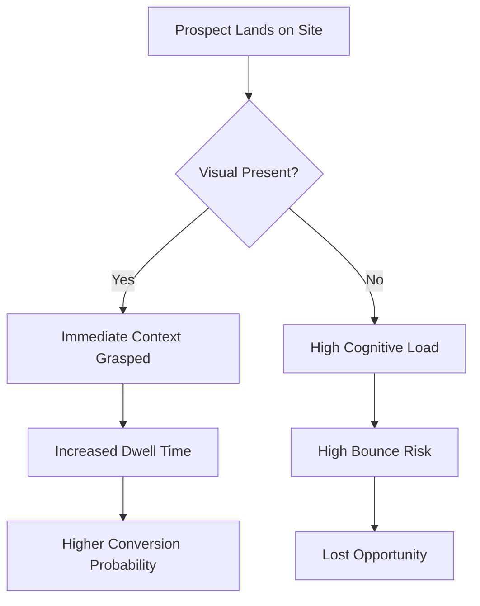
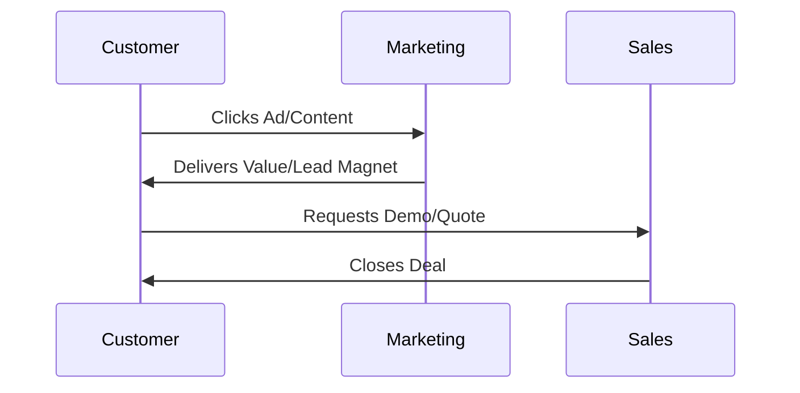
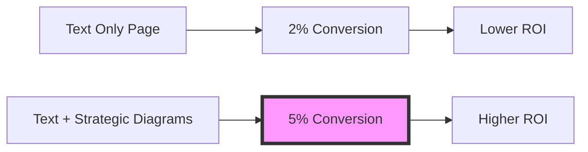

In the modern digital landscape, the attention span of a potential customer is shorter than ever. For business owners and startup founders, the challenge is no longer just about getting a visitor to your website; it is about keeping them there long enough to understand your value proposition. While high-quality copy is the backbone of communication, visual content—specifically inline images and strategic diagrams—acts as the nervous system that transmits your message with speed and clarity.

At MASK Intelligence, we view content not just as information, but as a conversion engine. If your website or blog is a "wall of text," you are inadvertently creating friction for your audience. This article explores the strategic necessity of testing and implementing inline images and diagrams to drive business results, reduce bounce rates, and ultimately increase your bottom line.

## The Psychology of Visual Processing in Business

As a business leader, you understand that time is your most valuable asset. The same applies to your customers. Humans are biologically hardwired to process visual information significantly faster than text. Research indicates that the human brain processes images approximately 60,000 times faster than it processes written words. 

When a prospect lands on your page, they are looking for immediate cues that they are in the right place. A well-placed inline image acts as a cognitive anchor. It provides context before a single sentence is read. This is not just "decoration"; it is a strategic maneuver to lower the "cognitive load" on your visitor. 

### Reducing Friction and Decision Fatigue
Every paragraph of text requires effort to decode. For a busy CEO or a founder looking for a solution, too much text can lead to decision fatigue. By integrating diagrams and images, you break the monotony and provide "mental breathing room." This allows the reader to digest complex information in bite-sized, visual chunks, making your brand appear more accessible and professional.

{: .align-center}

## Strategic Implementation: Beyond Stock Photos

One of the most common mistakes small business owners make is using generic stock photography that adds no value. To see a real ROI, your inline images must be intentional. They should serve one of three primary purposes:

1.  **Instructional Clarity:** Showing how a product works or how a service is delivered.
2.  **Social Proof:** Displaying real-world results, team photos, or client success stories.
3.  **Data Visualization:** Turning abstract numbers into tangible growth charts.

### The Role of Diagrams in Complex Sales
If you are selling a complex service—such as a SaaS platform, a logistics solution, or a financial consulting package—words often fail to capture the "flow" of your value. This is where technical diagrams become a sales tool. A flowchart can explain a 10-step onboarding process in five seconds, whereas a text description might take five minutes to read and still leave the prospect confused.

## The Business Case for Mermaid.js and Dynamic Diagrams

For the non-technical decision-maker, the term "Mermaid.js" might sound like developer jargon. However, from a strategic perspective, it represents a shift toward "Content as Data." Traditional images are static; if your process changes, you have to hire a designer to update the image. 

By using code-based diagrams, your content remains agile. For a startup founder, agility is everything. You can update your business workflows, supply chain diagrams, or organizational charts in real-time. This ensures that your prospects are always looking at the most current version of your business model.

### Why Diagrams Trump Long Explanations
Consider a "Customer Journey" map. You could write 1,000 words describing how a lead moves through your funnel, or you could present a clear, professional diagram. The diagram wins every time because it allows the stakeholder to see the "big picture" instantly.

## SEO and Accessibility: The Hidden ROI

When we talk about "testing inline images," we aren't just talking about how they look. We are talking about how they perform in the eyes of search engines like Google. 

### The Power of Alt Text
Every image you include in your content is an opportunity to improve your SEO. "Alt Text" (Alternative Text) is a brief description of an image that helps search engines understand what the image represents. For a business owner, this is a prime real estate for keywords. 

However, the real business value of Alt Text lies in **Accessibility**. Ensuring your site is readable by screen readers for the visually impaired is not just a legal or ethical consideration—it expands your market reach. A site that is accessible is a site that ranks higher and converts more.

### Image Optimization and Site Speed
Business owners often worry that high-quality images will slow down their website. This is a valid concern, as a one-second delay in page load time can lead to a 7% reduction in conversions. The strategy here is not to avoid images, but to optimize them. Using modern formats and ensuring images are "inline" (part of the content flow) ensures that your site remains fast while staying visually engaging.

{: .align-center}

## Integrating Visuals into Your Content Workflow

To achieve a 10-minute read depth that actually keeps a reader engaged, you must treat your content like a magazine layout rather than a legal brief. Here is how a professional content strategist at MASK Intelligence approaches a visual-first article:

### 1. The Audit Phase
Before writing, identify the "friction points" in your topic. Where is the reader likely to get confused? Where are the data points that look boring in a list? These are the locations for your diagrams and images.

### 2. The Narrative Bridge
An inline image should never stand alone. It should be introduced by the text and followed by an analysis. This creates a narrative bridge that guides the reader’s eye through the page.

### 3. The Consistency Check
Your visuals must match your brand identity. If your brand is "Professional and Authoritative," your diagrams should be clean, minimalist, and use a consistent color palette. Mismatched visuals create a sense of "brand disjointedness" that can erode trust.

## Measuring the Success of Visual Content

How do you know if your investment in visual content is paying off? As a business owner, you should look at three specific Key Performance Indicators (KPIs):

### Average Time on Page
If users are spending more time on your articles after you add diagrams and images, it’s a sign that your content is "sticky." They are stopping to look at the visuals and reading the surrounding text.

### Scroll Depth
Using heatmaps or analytics, you can see how far down a page a user travels. Visuals act as milestones that encourage the user to keep scrolling. If you see a significant drop-off at a large block of text, that is your cue to insert an inline image.

### Conversion Rate (CVR)
Ultimately, the goal is action. A/B testing pages with and without diagrams often reveals that pages with visual explanations have a higher conversion rate for "Request a Quote" or "Sign Up" buttons.

## Common Pitfalls to Avoid

While images are powerful, poorly executed visual strategies can backfire. Avoid these common mistakes:

*   **Irrelevant Visuals:** Don't add an image just to have one. If it doesn't clarify or enhance the message, it's a distraction.
*   **Low Resolution:** Blurry images signal a lack of professionalism.
*   **Over-complicating Diagrams:** A diagram that requires its own manual to understand defeats the purpose. Keep it simple.
*   **Ignoring Mobile Users:** Ensure your diagrams and images are "responsive." A complex flowchart that is unreadable on a smartphone will alienate a large portion of your audience.

{: .align-center}

## Conclusion: Visuals as a Competitive Advantage

In a world where everyone is producing content, the winner is not the one who writes the most, but the one who communicates the most effectively. For small and medium business owners, testing and implementing inline images and diagrams is not a "nice-to-have" design choice—it is a fundamental business strategy.

By reducing cognitive load, improving SEO, and providing clear paths to understanding through tools like Mermaid.js, you position your brand as a leader. You show your prospects that you value their time and that you are capable of simplifying complex problems.

At MASK Intelligence, we recommend a "Visual-First" approach to all high-stakes content. Whether you are building a personal brand or scaling a startup, remember: a picture is not just worth a thousand words; in the world of business, it can be worth thousands in revenue.

### Key Takeaways for Business Owners:
*   **Prioritize Clarity:** Use diagrams to explain your "How" and "Why."
*   **Invest in Quality:** Avoid generic stock; use branded, purposeful visuals.
*   **Optimize for Search:** Never skip Alt Text and image compression.
*   **Iterate and Test:** Use analytics to see which visuals are actually keeping your audience engaged.

By following these guidelines, you transform your digital presence from a passive information source into an active, visual-driven growth engine.

# Unveiling Digital Potential Through Intelligent Solutions

**[MASK Intelligence](https://mask-intelligence.web.app)** is your dedicated partner for digital transformation. We specialize in translating business vision into powerful, custom-built online realities—from professional websites and e-commerce stores to complex web applications and analytics dashboards.

## Our Services:

- **Domain Registration**
- **Professional Websites** 
- **Professional Email Hosting**
- **Google Business Profile Setup**
- **Business Plan Development**
- **Application Building**
- **Web Hosting**
- **E-Commerce Stores**

---

**[Visit MASK Intelligence →](https://mask-intelligence.web.app)**

**[Email Us →](mailto:maskintelligence@gmail.com)**

---

**Contact Information:**
- **Email:** maskintelligence@gmail.com
- **Phone:** +256 791 715 573

---
