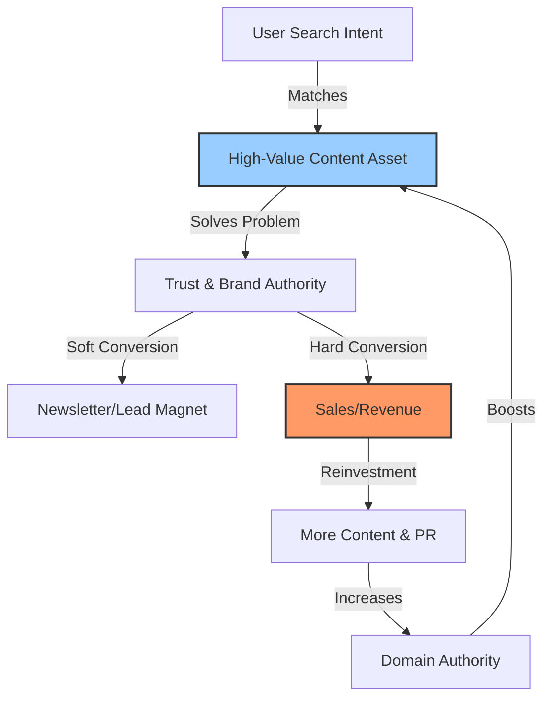
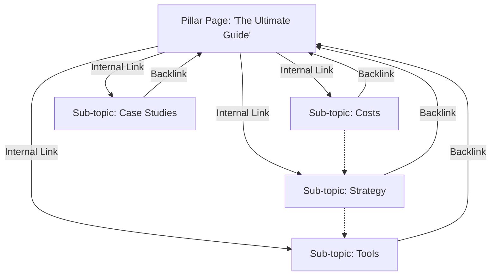

For years, business owners have been sold a lie. They’ve been told that the goal of Search Engine Optimization (SEO) is "ranking #1" or "getting more traffic." 

This is a fundamental misunderstanding of the channel. Traffic that doesn't convert is a liability, not an asset. It costs server resources and skews your data without adding a cent to your bottom line.

In 2026, the businesses winning online aren't the ones with the most clicks; they are the ones treating SEO as a capital investment rather than a marketing expense. They understand that while paid ads are like renting a reliable car, SEO is like building a high-speed railway: it takes longer to construct, but once it's running, it moves massive volume at a fraction of the cost per passenger.

This article outlines the strategic shift from "vanity SEO" to "revenue-driven SEO" and how it serves as a primary engine for long-term business valuation and expansion.

## The Financial Case: Asset vs. Expense

To understand the value of modern SEO, you must first look at your Customer Acquisition Cost (CAC). 

In the world of paid advertising (PPC), your CAC is linear. If you want 100 new customers, you pay for 100 clicks (plus the markup for competition). As soon as you stop paying, the leads stop flowing. Worse, ad costs historically rise year-over-year due to inflation and increased competition.

Organic search operates on an **inverse cost curve**. 

You invest heavily upfront—in strategy, content production, and technical architecture—with little immediate return. However, as your "digital real estate" matures, it begins to attract customers 24/7 without a direct marginal cost for each new visitor.

### The Compounding ROI of Organic Search
Recent industry data suggests that while paid search offers a respectable average ROI of roughly 3.2x, effective SEO campaigns can deliver an average ROI of **5.3x over the long term**. Furthermore, SEO leads have a close rate of **14.6%**, compared to just 1.7% for outbound leads.

This difference isn't just about marketing efficiency; it's about business valuation. A company with a proprietary, organic lead generation engine is worth significantly more to investors or buyers than a company dependent on renting traffic from Google or Meta.

## The Shift: From "Keywords" to "Business Intent"

The era of stuffing keywords into a page is dead. With the rise of AI Overviews and Semantic Search, Google now understands the *intent* behind a search, not just the text string.

For a business owner, this means your strategy must pivot from "What are people searching for?" to "What problems are my high-value customers trying to solve?"

### The Three Tiers of Search Intent
1.  **Informational (Low Value):** "What is CRM software?"
    *   *Goal:* Brand awareness.
2.  **Commercial Investigation (Mid Value):** "Best CRM for real estate agents 2026"
    *   *Goal:* Consideration and comparison.
3.  **Transactional (High Value):** "Book Salesforce implementation demo"
    *   *Goal:* Revenue.

Modern SEO prioritizes the bottom two tiers. It is better to rank for 50 keywords that drive revenue than 5,000 keywords that drive idle browsers.

### Visualizing the Strategy
The following diagram illustrates how a modern SEO ecosystem functions. It is not a funnel that ends; it is a cycle where content builds authority, authority drives rankings, and rankings drive revenue—which funds more content.

## Modern SEO in the Age of AI (2026)

You cannot discuss SEO today without addressing Artificial Intelligence. With Google's AI Overviews (formerly SGE) occupying the top of search results, the "ten blue links" are no longer the only game in town.

### How to Win in an AI-First World
AI engines answer questions by synthesizing information from authoritative sources. To be cited by these AI models, your business must demonstrate **E-E-A-T** (Experience, Expertise, Authoritativeness, and Trustworthiness).

*   **Experience:** Show, don't just tell. Use case studies, original data, and real client stories.
*   **Expertise:** Ensure content is written or reviewed by qualified professionals in your field.
*   **Authoritativeness:** Earn mentions from other reputable industry sites (digital PR).
*   **Trustworthiness:** Secure your site technically and be transparent about who you are.

If your content is generic "AI slop" generated by a cheap tool, you will be invisible. If your content offers unique insights that an AI cannot hallucinate, you will become the source it cites.

## The "Content Cluster" Methodology

To dominate a market niche, you cannot rely on scattered blog posts. You need to build **Topical Authority**. This is achieved through a "Hub and Spoke" model, or Content Clusters.

### The Structure
1.  **Pillar Page (The Hub):** A comprehensive guide covering a broad topic (e.g., "Complete Guide to Commercial Roofing"). This page targets high-volume, competitive keywords.
2.  **Cluster Pages (The Spokes):** Specific articles addressing sub-topics (e.g., "Flat Roof Repair Costs," "TPO vs. EPDM," "Roof Maintenance Checklist"). These link back to the Pillar Page.

This structure signals to search engines that you are the ultimate authority on "Commercial Roofing." It forces the algorithm to recognize your depth of knowledge, lifting the rankings of *all* pages in the cluster.

## Measuring What Matters: Revenue, Not Rankings

The most common failure in business SEO is tracking the wrong metrics. If your agency sends you a report highlighting "Impressions" but cannot explain how that impacted "Sales," you have a problem.

### The New SEO Scorecard
Abandon vanity metrics. Here is what you should demand from your marketing team:

1.  **Organic Revenue Attribution:** How much revenue originated from a search engine?
2.  **Conversion Rate by Page:** Which specific articles are driving phone calls or demos?
3.  **Keyword Velocity:** Are we gaining visibility for *commercial* terms?
4.  **Assisted Conversions:** Did a user read a blog post 30 days ago and return today via a direct ad to buy? (SEO often assists paid channels).

### The "Zero-Click" Reality
A growing trend in 2026 is "Zero-Click Search," where a user gets their answer from the Google results page without clicking. 

Does this mean SEO is failing? No. It means the metric has changed. If a user sees your brand name, gets their answer, and remembers you, that is a branding win. You measure this by tracking **Branded Search Volume**—how many people are searching for your company by name? If this number is rising, your SEO is working.

## Conclusion: Playing the Long Game

SEO is not a faucet you turn on and off; it is an investment portfolio. 

In the short term, it requires patience, capital, and a refusal to cut corners. But in the long term—12, 24, 36 months out—it becomes the single most profitable channel in your business. It lowers your blended customer acquisition cost, insulates you from ad price hikes, and builds an asset that increases your company's valuation.

**The choice for business owners is clear:** 
Do you want to keep paying rent for your traffic, or is it time to start building equity?

---
*Ready to stop renting your traffic? MASK Intelligence helps businesses build sustainable, revenue-focused organic growth engines. Contact us today to audit your current digital footprint.*

# Unveiling Digital Potential Through Intelligent Solutions

**[MASK Intelligence](https://mask-intelligence.web.app)** is your dedicated partner for digital transformation. We specialize in translating business vision into powerful, custom-built online realities—from professional websites and e-commerce stores to complex web applications and analytics dashboards.

## Our Services:

- **Domain Registration**
- **Professional Websites** 
- **Professional Email Hosting**
- **Google Business Profile Setup**
- **Business Plan Development**
- **Application Building**
- **Web Hosting**
- **E-Commerce Stores**

---

**[Visit MASK Intelligence →](https://mask-intelligence.web.app)**

**[Email Us →](mailto:maskintelligence@gmail.com)**

---

**Contact Information:**
- **Email:** maskintelligence@gmail.com
- **Phone:** +256 791 715 573

---
