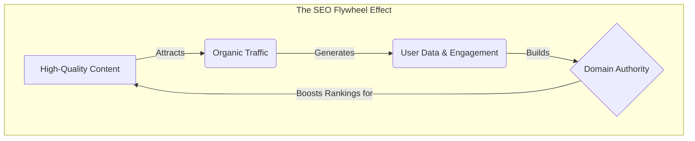

Imagine you are looking for a new office space. You have two options. 

Option A is a premium rental in a busy district. It’s fully furnished, and the moment you sign the lease, you have foot traffic. But the second you stop paying rent, you’re evicted, and your visibility vanishes instantly. 

Option B is buying a plot of land and building your own headquarters. It takes time to lay the foundation and construct the building. At first, it’s just a construction site. But once it’s built, you own it. It becomes an asset on your balance sheet that appreciates over time, attracting visitors without a monthly rental invoice for every single person who walks through the door.

In the digital world, **Option A is Paid Advertising (PPC)**. **Option B is Search Engine Optimization (SEO)**.

For too long, business owners have viewed SEO as a dark art practiced by developers in hoodies—a technical checklist of keywords and code. This is a mistake. In 2026, SEO is not a technical task; it is a **capital investment in your digital real estate**.

This guide is written for you—the decision-maker. We will strip away the jargon and focus on the economics of organic growth, explaining why SEO is the most powerful engine for sustainable revenue in the modern business landscape.

## The Organic Growth Engine: Owning vs. Renting

The fundamental difference between paid ads and SEO is the difference between linear and exponential growth. 

When you pay for traffic (Google Ads, Meta Ads), your results are linear. If you want 1,000 more visitors, you must pay for 1,000 more clicks. Your Cost Per Acquisition (CPA) remains relatively flat, or often increases as competition rises.

SEO creates an **Organic Growth Engine**. In the early stages, you invest resources (content, technical optimization, PR) without seeing an immediate spike in revenue. However, unlike ads, every piece of high-quality content you publish is a permanent asset. It works for you 24/7, year after year. 

As your site builds authority, it becomes easier to rank for *new* keywords. Your traffic begins to compound, while your cost per visitor trends downward toward zero.

### Visualizing the ROI Curve

The following diagram illustrates the divergence between paid and organic strategies over 24 months.

### The Compounding Effect of SEO
1.  **Asset Accumulation:** A blog post written in 2024 can still drive qualified leads in 2026. An ad campaign from 2024 stopped generating leads the day you turned it off.
2.  **Authority Moat:** As you dominate search results, you push competitors down. You aren't just winning traffic; you are capturing market share that is incredibly difficult for competitors to steal back without years of effort.
3.  **Trust Premium:** Data consistently shows that organic search results have a higher click-through rate (CTR) and conversion rate than paid ads. In fact, **organic leads convert at an average rate of 14.6%**, compared to just 1.7% for outbound leads. Users trust the "natural" winner more than the "sponsored" placement.

## The Three Pillars of Modern SEO

You don't need to know how to code to manage an SEO strategy, but you do need to understand the three pillars that support it. If your SEO agency or team ignores any one of these, your engine will stall.

### 1. Technical Health (The Foundation)
Think of this as the plumbing and electricity of your building. It doesn't matter how beautiful your furniture is if the roof is leaking.
*   **Speed:** Does your site load in under 2 seconds? (40% of users abandon a site that takes longer than 3 seconds).
*   **Mobile-First:** Google predominantly uses the mobile version of your site for indexing. If your site is clumsy on a smartphone, you are invisible.
*   **Crawlability:** Can search engine bots actually read your site?

**Business Question to Ask:** "Is our website infrastructure helping or hurting our ability to be found?"

### 2. Content & Experience (The Fuel)
Content is not just "blog posts." It is the solution to your customer's problems. In the age of AI, generic content is worthless. Google rewards **E-E-A-T**: Experience, Expertise, Authoritativeness, and Trustworthiness.
*   **Relevance:** Are you answering the questions your customers are actually asking, or just talking about your products?
*   **Depth:** Does your content provide more value than the current top-ranking result?
*   **User Intent:** Are visitors looking to *buy* (transactional) or *learn* (informational)? Your content must match their goal.

**Business Question to Ask:** "If I were a customer, would this page be the absolute best answer to my question?"

### 3. Authority (The Reputation)
This is your digital reputation. Search engines determine your authority primarily through **backlinks**—links from other reputable websites pointing to yours.
*   **Quality over Quantity:** One link from a major industry publication (e.g., *Forbes*, *TechCrunch*, or a leading trade journal) is worth more than 1,000 links from low-quality directories.
*   **Digital PR:** Modern link building is really just good public relations. It’s about getting your brand mentioned in the places your customers already congregate.

**Business Question to Ask:** "Who is vouching for us online?"

## The "Near Me" Goldmine: Local SEO for Business Owners

If you have a physical location or serve a specific geographic area, Local SEO is not optional—it is survival.

Recent statistics paint a clear picture:
*   **84%** of local searches are conducted on mobile devices.
*   Searches for "open now near me" have grown by **400%** in recent years.
*   **76%** of people who search for something nearby on their smartphone visit a related business within a day.

### The Google Business Profile (GBP)
Your Google Business Profile (formerly Google My Business) is likely the first interaction a customer has with your brand—often before they even visit your website. It is your "digital storefront."

**Strategic Mandates for Local SEO:**
1.  **Claim and Verify:** Ensure you own your listing.
2.  **Review Management:** Reviews are a ranking factor and a conversion factor. You need a system to solicit reviews from happy customers and a protocol for responding to negative ones professionally.
3.  **NAP Consistency:** Your Name, Address, and Phone number must be identical across every directory on the web (Yelp, Yellow Pages, etc.). Discrepancies confuse Google and lower your rankings.

## The Elephant in the Room: AI and the Future of Search

You may have read headlines claiming "SEO is Dead" due to ChatGPT or Google's AI Overviews. Let’s clarify the reality for 2026.

AI is not killing search; it is **fragmenting** it.

Users are increasingly turning to AI for simple answers ("What is the capital of France?"). This means "zero-click" searches are rising for basic informational queries. However, for complex buying decisions ("Best ERP software for manufacturing" or "Top-rated divorce lawyer in Chicago"), users still demand deep, authoritative human content.

### Adapting to the AI Era
*   **Target "High-Intent" Keywords:** Focus less on defining basic terms and more on solving complex problems where human expertise is required.
*   **Brand is the Ultimate Defense:** In a world of AI-generated noise, a strong brand is the only thing that cannot be faked. People search for brands they trust.
*   **Diversify Traffic:** Do not rely solely on Google. Your SEO strategy should feed into your email list, social media, and video content.

## Measuring What Matters: Moving Beyond "Rankings"

A common trap for business owners is obsessing over "vanity metrics." Ranking #1 for a keyword that no one searches for is useless. Ranking #1 for a keyword that drives traffic but no sales is a waste of money.

Stop asking: "Where do we rank?"
Start asking: "How much revenue is organic search driving?"

### The Business Owner's SEO Scorecard
Here are the KPIs (Key Performance Indicators) you should review quarterly:

| Metric | Why It Matters |
| :--- | :--- |
| **Organic Revenue** | The total dollar value of sales generated from organic traffic. |
| **Organic Conversion Rate** | The percentage of SEO visitors who become leads or customers. |
| **Non-Branded Traffic** | Traffic from people who found you *without* searching your company name (this proves growth). |
| **Keyword Visibility** | The percentage of your target market's search queries where you appear. |

## Conclusion: The Best Time to Plant a Tree

There is an old Chinese proverb: *"The best time to plant a tree was 20 years ago. The second best time is now."*

SEO is that tree. 

If you had started a serious SEO strategy two years ago, you would currently be enjoying a steady stream of leads with a near-zero marginal cost. You would have a digital moat protecting you from competitors. You would be less reliant on the volatile prices of paid advertising.

But you cannot change the past. You can only decide what your business will look like 12 months from now.

Will you still be renting your traffic, vulnerable to price hikes and algorithm changes? Or will you be the owner of a high-performance Organic Growth Engine that drives wealth and stability for your company?

The choice is yours. But remember: while you are deciding, your competitors are likely already building.

---

### Key Takeaways for the Executive
*   **SEO is an Asset:** Treat it like real estate, not an expense.
*   **Compounding Returns:** Organic traffic grows exponentially; paid traffic grows linearly.
*   **Quality Wins:** In the AI era, human expertise (E-E-A-T) is the premium currency.
*   **Local is Critical:** If you have a physical presence, ignoring local SEO is ignoring 84% of your mobile customers.
*   **Measure Revenue:** Ignore vanity metrics. Focus on ROI and conversions.

# Unveiling Digital Potential Through Intelligent Solutions

**[MASK Intelligence](https://mask-intelligence.web.app)** is your dedicated partner for digital transformation. We specialize in translating business vision into powerful, custom-built online realities—from professional websites and e-commerce stores to complex web applications and analytics dashboards.

## Our Services:

- **Domain Registration**
- **Professional Websites** 
- **Professional Email Hosting**
- **Google Business Profile Setup**
- **Business Plan Development**
- **Application Building**
- **Web Hosting**
- **E-Commerce Stores**

---

**[Visit MASK Intelligence →](https://mask-intelligence.web.app)**

**[Email Us →](mailto:maskintelligence@gmail.com)**

---

**Contact Information:**
- **Email:** maskintelligence@gmail.com
- **Phone:** +256 791 715 573

---
